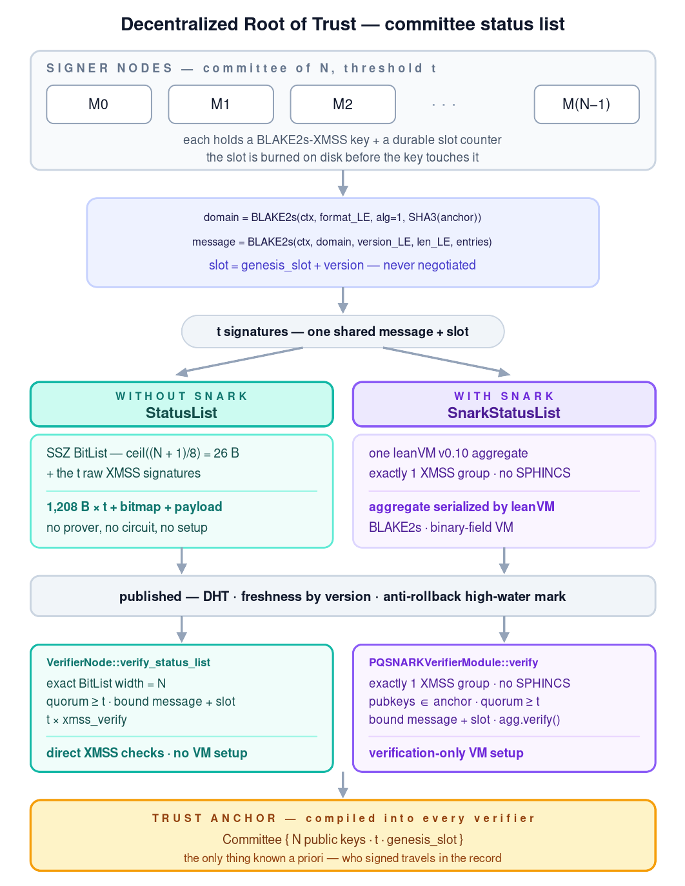

# decentralized-root-of-trust

**Removing the single key at the root of a trust hierarchy, without giving up
offline verification — and without assuming an adversary that cannot run a
quantum computer.**

---

## The problem

Systems that issue credentials — PKI, verifiable credentials, firmware update
channels, device attestation — publish a **status list**: the set of identifiers
that have been revoked. That list is the security-critical object. If an attacker
can rewrite it, they can un-revoke a stolen key; if they can freeze it, they can
keep a compromised device trusted indefinitely.

Almost universally, that list is authorized by **one signing key**. This
concentrates two separate failures into a single point:

- **Compromise.** Whoever holds the key controls revocation for the entire
  system. There is no quorum to overrule them and no partial failure mode.
- **Cryptographic obsolescence.** The signature is typically ECDSA or Ed25519,
  both broken by a sufficiently large quantum computer. Records that are archived
  and verified years later are exposed to *store-now-decrypt-later* on the
  signature layer.

The obvious fix — have `N` parties sign instead of one — reintroduces a cost that
is usually what stopped people: `t` signatures are `t` times the bytes and `t`
times the verification work, on every published update, forever. For a
constrained verifier (an embedded controller, a light client, an offline device)
that is not a marginal cost.

## What this builds

A status list controlled by a **`t`-of-`N` committee**, where the published
evidence of quorum is **one constant-size object** rather than `t` signatures.

- Members sign with **XMSS** — hash-based, stateful, post-quantum, and *not*
  reliant on any number-theoretic assumption.
- The `t` signatures are aggregated by the [leanVM](https://github.com/leanEthereum/leanVM)
  zkVM into a **single SNARK proof** that attests "a quorum of this committee
  signed this list at this version".
- A verifier holds **one fixed trust anchor** — the committee's `N` public keys,
  the threshold `t`, and a genesis slot — and needs **no live data fetch**,
  no directory lookup, and no revocation service to check an update.

Both the aggregated form and the raw `t`-signature form are implemented and
measured, so the trade-off is a number in this repository rather than an
assertion.

## What it demonstrates

The repository is built to make six claims falsifiable, each with the artifact
that tests it:

| Claim | Where it is checked |
|---|---|
| A quorum of the committee — and nothing else — can authorize an update | five checks in `PQSNARKVerifierModule::verify`, exercised by the forgery corpus |
| Evidence cannot be lifted from one list, version or slot onto another | `attack-tampered`, `attack-outsider`, `attack-version` must all be rejected |
| Evidence cannot be lifted from one *committee* onto another | the domain seeding the signed message ([Domain separation](#domain-separation-one-anchor-one-list)) |
| A peer cannot choose how much verification work a node does | the selection budget in `accept_best` / `select_freshest_above` |
| A stale but validly signed record cannot be replayed | the persistent anti-rollback gate in [`src/state/freshness.rs`](src/state/freshness.rs) |
| Aggregation is worth its cost above some `t`, and is not below it | [Benchmark](#benchmark), which measures both forms on the same host |

Two properties are treated as safety-critical rather than best-effort, because
their failure modes are silent and unrecoverable:

- **XMSS is stateful.** A `(key, slot)` pair that signs twice leaks enough of the
  WOTS hash chains to forge for that slot. Slot allocation therefore goes through
  a durable, crash-safe counter that burns a slot *before* the key touches it
  ([`src/state/slot_counter.rs`](src/state/slot_counter.rs)).
- **Verification is stateless.** An old record verifies forever, so the
  cryptography alone cannot refuse a rollback. That is a separate, explicitly
  stateful gate.

## What it is not

A research prototype measured on one machine, not a deployment. Committee
rotation is not implemented, and every number in [Benchmark](#benchmark) is
host-specific — the binaries are built with `target-cpu=native`. The open gaps
are listed in [`AGENTS.md`](AGENTS.md) rather than left for the reader to discover.

---



Editable source: [`docs/architecture.svg`](docs/architecture.svg).

---

## Trust model

- The list is published (e.g. in a DHT) together with **evidence of a quorum**
  that replaces the old single signature.
- The fixed **trust anchor** each verifier embeds is the **committee**: its `N`
  public keys, the threshold `t`, and the genesis slot.
- An update is authorized when **at least `t`** distinct committee members sign
  the new list root. *Which* subset signs may change at every update — the
  anchor does not.

The evidence comes in two interchangeable forms, described in
[Two published forms](#two-published-forms). Both are checked in five steps:

1. every signer ∈ committee (membership);
2. the evidence is bound to **this** committee, **this** list *and this version*
   (`message == status_list_root(domain, list, version)`);
3. the slot is the one the anchor assigns to this version
   (`slot == genesis_slot + version`);
4. quorum reached (`#signers ≥ t`);
5. the signatures — or the one aggregate that stands for them — verify.

Check (2) is the security-critical binding: a signature only attests "this key
signed *this* message"; the verifier must recompute that message from the list
*and version* it holds and compare. See
[Versioning and freshness](#versioning-and-freshness) for why the version is part
of the message and not a field next to it, and
[Domain separation](#domain-separation-one-anchor-one-list) for why the committee
is part of it too.

Check (3) pins policy rather than integrity — the slot is already authenticated
inside every signature, since it feeds the leaf hash, the WOTS tweaks and the
Merkle path directions. What it forbids is a quorum re-signing one version at
slots of its own choosing. See [Slot derivation](#slot-derivation).

---

## Signature scheme

Signing uses **leanVM's own synchronized XMSS** (Poseidon2, `LOG_LIFETIME = 32`)
— the scheme leanVM can aggregate. Since leanVM v0.9 its public API takes a raw
32-byte message and embeds it into the eight field elements the WOTS encoding
consumes; this project hands it `status_list_message`, the canonical packing of
the Poseidon2 root described under [Two published forms](#two-published-forms).

It is a *stateful* signature: a given `(key, slot)` must sign **at most once**, so
each update uses a new slot. v0.9 narrowed what that protects without removing
the rule. Signing is now derandomized — the randomness is derived from
`(secret seed, slot, attempt, hashed message)` — so re-signing the *same* message
at the same slot returns a bit-identical signature and is harmless. Two
**different** messages at one slot still expose enough of the WOTS hash chains to
forge, and that is the case the durable slot counter exists for. It cannot tell
the two apart without keeping a history of every message it has signed, which is
exactly the state a counter exists to avoid.

> Note: the standalone `leanSig` XMSS (Poseidon1, `LOG_LIFETIME = 18`)
> is a **different, incompatible** parametrization and **cannot** be fed to
> leanVM's aggregator. This project therefore signs with leanVM's XMSS only.

A key is generated for a **window** — an activation slot and a slot count, or
`SLOT..=SLOT + KEY_SLOTS` as this project states it — and the window is
baked into its identity: leaves outside it are pseudorandom fillers
(`gen_random_node`) that feed the Merkle root, so regenerating the same seed with
a wider window yields a *different* public key. A window cannot be extended — an
exhausted key can only be replaced. `remaining_slots()` is what a node watches to
start that replacement in time, since a key with no slots left cannot even sign
its own successor.

---

## Two published forms

Both carry the same payload and the same signed message. They differ only in how
the quorum is evidenced, and a verifier accepts either.

### Wire format and canonicality

Published `StatusList` and `SnarkStatusList` records use **SSZ
(SimpleSerialize)**, with a fixed schema and field order. SSZ gives each decoded
record one valid byte representation: malformed offsets, trailing bytes and
alternative length encodings are rejected. This makes a content-addressed record
stable — equal records have equal bytes and therefore the same object identifier.

The committee anchor is SSZ too, which matters because the freshness gate
fingerprints it to identify its trust domain: a second byte-encoding of the same
committee would read as a rotation and silently reset the anti-rollback mark.

Since leanVM v0.9 the cryptographic objects *inside* those containers are SSZ as
well. `XmssSignature` is a fixed 1208 bytes and `XmssPublicKey` a fixed 32, field
elements written as canonical little-endian `u32` and refused on decode at or
above the modulus. So canonicality is a property of the schema rather than
something this project enforces by decoding and re-encoding, as it had to when
those objects were opaque postcard blobs. The one exception is the aggregate
proof, which cannot be a typed field — deserializing it needs the process-global
aggregation bytecode — and is therefore still canonicalized by re-encoding and
comparing.

This is a wire-format commitment. Records, anchors, keys and proofs produced
before leanVM v0.9 are not compatible and must be regenerated.

| | `StatusList` | `SnarkStatusList` |
|---|---|---|
| evidence | the `t` raw signatures + a signer bitmap | one aggregated SNARK proof |
| naming the signers | 26 B bitmap (`N + 1` bits) | public keys inside the aggregate |
| prover | none | 750 ms · 2.1 GB |
| verifier setup | none | ~5 s · 651 MB resident |
| verify | `t` × `xmss_verify`, linear in `t` | one check, flat in `t` |
| payload at `t=128` | ≈ 155 KB | ≈ 234 KB |
| entry point | `VerifierNode::verify_status_list` | `PQSNARKVerifierModule::verify` |

A signer is named by its **index into the committee's member list**. The anchor
already fixes and authenticates that order, so the index is a stable identifier
that costs one bit. Against a list of identifiers — public keys, DIDs, names —
the bitmap buys three things:

- **Structural distinctness.** A bit is set or it is not, so a member cannot
  appear twice. With a list you must remember to reject duplicates, and
  forgetting turns `t`-of-`N` into "one member signs `t` times".
- **A canonical encoding.** One signer set has exactly one bitmap, where a list
  of `t` identifiers has `t!` orderings — all valid, all distinct on the wire,
  which breaks deduplication once records are content-addressed in a DHT.
- **No key material on the wire.** Membership stops being a check at all: an
  index *is* a member, so a non-member is unnameable rather than merely rejected.

The bitmap is an SSZ `BitList`, not a byte array, and that is a security choice.
A byte array pins down how many *bytes* there are but never how many *bits* mean
something, so the bits above member `N-1` are free: one signer set gets several
encodings, and an index past the end of the committee becomes representable — a
verifier that indexed its member list with one would panic. A `BitList` appends a
sentinel bit after the last real bit, so the length in bits is recovered exactly
on decode, excess bits are rejected, and the whole class disappears. It costs one
bit, and it turns two hand-written checks into a single comparison against the
anchor. What no schema can express is a relation between two fields, so
`from_bytes` still rejects a bitmap whose population disagrees with the number of
signatures.

What the bitmap does **not** hide is the participation pattern: anyone holding the
anchor learns who signed, and correlating records over time reveals which members
are always present. That is disclosure of behaviour, not of secrets, and it is
unavoidable — a verifier cannot check a signature without knowing whose key to
check it against. Note this leaks *less* than the SNARK path, whose aggregate
carries the signers' full public keys.

---

## Domain separation: one anchor, one list

A signature attests "this key signed *these bytes*" and nothing more. So whatever
is **not** inside the signed message is not bound by the signature — and until the
message carried a domain, what it carried was `(list, version)` alone.

That made evidence portable in a way nothing in the protocol acknowledged. Any two
deployments whose anchors happened to coincide had interchangeable records: a
record published under one verified, in full, under the other. Membership, quorum,
slot and message binding all pass, because from the verifier's side there is
nothing to distinguish them.

The fix is to start the Poseidon2 fold from a **domain-specific IV** instead of
`[0; 8]`. The domain is derived once, by the anchor itself
(`Committee::domain`), from three things:

| bound | why |
|---|---|
| SHA3-256 of the anchor's canonical encoding | every member key, `t` and `genesis_slot`. A different committee — or a rotated one — is a different domain, so evidence never crosses between them |
| the record's `alg` | a record cannot be relabelled to another signature scheme while keeping evidence produced under the first. Latent while one algorithm exists, and cheapest to add before it does |
| a construction generation | bumping it retires every message signed under the old shape |

It is **prefixed, not appended**, and that part is load-bearing. A Merkle–Damgård
chain that starts from a shared IV lets every domain share its intermediate
states, so a single internal collision found against attacker-chosen entries would
be reusable across all of them. A domain-specific IV leaves two domains with no
common prefix to attack.

There is no way to compute a message without naming a domain, because
`status_list_message` takes one — so this is enforced by the type, not by a check
somebody has to remember.

**What it does not do.** The domain binds the *committee*, and one anchor has one
domain. So it settles "a status list is governed by exactly one committee", but
**not** "one committee governs exactly one status list": two lists under the same
anchor still produce interchangeable evidence. Closing that needs a list
identifier inside the anchor, which is a further wire change. Until then *one
anchor governs exactly one status list* is an operator invariant, pinned in
`committee.rs`'s `one_anchor_is_one_domain_so_it_governs_one_list`.

> This is a **signed-message** change, not a wire-schema one: the SSZ containers
> are byte-identical to before, and record sizes are unchanged. But keys, records
> and proofs generated earlier no longer verify — regenerate `artifacts/`.

---

## Slot derivation

XMSS is stateful, so each update must consume a fresh slot, and leanVM's
aggregation requires all `t` signatures of one update to sit at **the same** slot.
Letting each member advance a counter of its own cannot satisfy that once
`t < N`: the members who sit out a round do not advance, so by the next round they
disagree about the slot and aggregation becomes impossible — not eventually, but
by round two.

So the slot is **derived, never negotiated**, the way a validator computes its
slot from the clock:

```
slot = committee.genesis_slot() + version
```

`genesis_slot` lives in the anchor, which makes the derivation authenticated
rather than a convention each node must be trusted to follow. `Committee::slot_for`
is the only place it is computed — signer and verifier must agree bit for bit, and
two independent `genesis + version` expressions are two places to drift.

Three consequences:

- **`AtomicSlotCounter::reserve_at`** replaces "give me my next slot" with "give me
  *this* slot". Above the counter it burns every slot up to the requested one in a
  single durable write: a member that missed six rounds skips six slots rather
  than reclaiming them. Skipping is free — the window is `2^32` wide — while reuse
  costs the key.
- **Below the counter it refuses** (`AlreadySpent`), which doubles as the
  anti-double-sign guard: a version this member already signed maps to a spent
  slot and is unreachable, with no extra state to keep. Being refused is normal —
  the member abstains and the quorum proceeds without it. That is what `t < N` is
  for.
- **A failed round consumes a version.** If a round does not reach `t`, the
  members who did sign have already burned that slot, so the retry moves to the
  next version. `version` therefore counts *rounds attempted*, and the published
  sequence has gaps. Nothing downstream breaks: `try_advance` requires strictly
  greater, not consecutive.

It also bounds an attack. To forge a slot-consistent record at an inflated
version, an attacker needs a key covering `genesis + version` — so the reachable
lie stops at the end of the key window, not at `u32::MAX`.

---

## Versioning and freshness

Every published list carries a `version` (a `u32`), a counter the committee raises
at each update. The version is **part of the signed message**, not a loose field
sitting next to the proof: the committee signs `status_list_root(domain, list, version)`,
so one proof attests to the pair `(list, version)` as a whole. Alter the version
after signing and the proof stops matching — the record is rejected. That is the
third security test below.

The version is independent of the XMSS *slot* used to sign. The slot is the
one-time-signature epoch, bounded by the key lifetime; the version is an
application counter. Keeping them separate means the version keeps climbing across
a future committee re-key, when the slot window would reset.

### Does the verifier trust the version, or keep its own?

For a single record, neither — it **checks** it. `PQSNARKVerifierModule::verify` recomputes the
signed message from the version found *in the record* and compares it against what
the committee signed. The value is accepted only because it survived that check,
so once verification passes the version is as trustworthy as the list itself.
There is no separate step and nothing stored: a record is self-describing and
self-authenticating.

Picking *the newest* version is a different job, and it belongs one layer up,
where records are fetched. A Kademlia lookup returns several records from the
closest peers — different versions, some stale, perhaps one from a hostile peer.
`PQSNARKVerifierModule::select_freshest` is that policy:

1. order the candidates by their declared version, newest first;
2. verify them in that order and return the first that passes;
3. if the newest fails, fall back to the next, and so on.

The declared version only decides the *order*; it is trusted only after step 2
verifies the record. A peer that stamps a garbage record with version `4294967295`
to jump the queue therefore costs one failed verification before it is skipped —
it can never be selected. The `verifier` binary runs this over the `N_UPDATES`
updates plus a planted forgery (`attack-version.bin`) and selects the real
newest — at the current defaults, 20 updates and `version 19` — every time.

The forgery's declared version is `KEY_SLOTS` (64), not an arbitrarily large
number, and the reason is worth stating: `slot = genesis + version`, so lying
about the version means signing at the slot that version derives to, and the
attacker needs a key covering it. The end of the key window is therefore the
largest lie available. The forgery is built slot-consistent on purpose, so that
check 3 passes and check 2 — the message binding the version — is the one that
rejects it.

### Anti-rollback across time

Selecting the newest of the records *in hand* is not enough. Verification is
stateless — an old but validly signed `(list, version)` verifies forever — so a
peer that serves you *only* stale records slips past `select_freshest`. For an
authorization list this is the attack that matters: an old status list re-grants
access to a node that has since been revoked.

The fix is memory. `HighWaterMark` (in `freshness.rs`) records the highest version
this verifier has accepted and refuses anything not **strictly newer**. The rule
is strict on purpose: a tolerance window would reopen exactly the rollback it is
meant to close. The mark lives *outside* the verification predicate, which stays pure — crypto
first (`select_freshest`), freshness second (the mark) — and it is persisted, so
it survives a restart. It is keyed to a fingerprint of the anchor, so a committee
rotation legitimately resets the counter instead of rejecting the new generation.
This is local verifier state and must never be published.

Outside the predicate, but not outside a type. `RawNode` and `SnarkNode`
(`src/node/raw_node.rs`, `src/node/snark_node.rs`) hold an anchor and a mark
together and expose one entry point — `accept(bytes) -> Outcome` — which decodes,
verifies, and only then offers the version to the gate. The ordering is not
advice. A mark that advanced on a record which had not been authenticated could
be pushed to `u32::MAX` by any peer that can spell a version number, after which
every genuine update is refused as stale: a denial of service for the price of a
forged integer. Owning both halves is what makes that sequence the only one
expressible, the same way `SignerNode` owns its slot counter instead of trusting
callers to burn a slot first.

The mark also feeds *back into* selection. `select_freshest_above` takes it as a
floor and drops every candidate not strictly above it before verifying anything —
`select_freshest` is that function with no floor. This removes work, not attacks:
a record at or below the mark would verify and then be refused as stale anyway,
so the only difference is whether a SNARK verification was paid for first. It is
worth having because selection is the one place an unauthenticated peer chooses
how much work you do, and because the stale case is the *common* one — a node
polling a list that has not changed hits it every round. Filtering on the declared
version is sound for the same reason ordering by it is: understating your own
version only forfeits a record that was going to be refused, and cannot suppress
what a different peer served.

The `verifier` binary demonstrates both halves: it advances the mark to the newest
update, then replays an old but valid record and shows it refused. Run it twice
and the second run loads the mark from disk, reports how many candidates the floor
removed, and verifies none of them.

### What this does and does not guarantee

- **The version cannot be forged.** A record's version is exactly the one the
  committee signed, or the record does not verify.
- **Within a batch, the newest valid record wins.** `select_freshest` is robust to
  inflated versions and to peers returning junk.
- **A replay of an old version is refused** once a newer one has been accepted, and
  the refusal survives restarts — this is the high-water mark above.
- **A fork at the same version** — two different lists both validly signed at one
  version — cannot be ordered by version alone. Because XMSS forbids reusing a
  `(key, slot)` pair, an honest member never signs two lists at the same version,
  and with `t > N/2` two disjoint quorums cannot both reach threshold. A
  same-version fork therefore requires misbehaving members, not just a network
  attacker.
- **Not covered yet: committee rotation.** When the anchor changes, the mark
  resets, and how a verifier learns the new anchor (an `old signs new` hand-off, a
  chain of committees) is a separate protocol, deferred to its own design.

### Append-only proposals: what a *member* agrees to sign

Everything above is the relying party's side. A committee member has a symmetric
problem, and it is not the same one: it is asked to sign a list it did not
author, proposed by an aggregator it does not trust, and the storage layer that
holds the previous record is not an authority either. A member that simply signs
whatever arrives can be walked onto a fork by anyone who can replace the
published record.

`SignedHead` (`src/state/status_list_head.rs`) is the guard. It remembers the
exact `(version, entry count, digest)` this member last signed, and `successor`
admits a proposal only if all four conditions hold:

1. it names that digest as its `predecessor`;
2. it sits at exactly `head.version + 1`;
3. its list is longer than the entry count already signed;
4. **the prefix already signed re-folds to that digest** — the check that
   actually decides it, because it proves the proposal extends the list this
   member signed rather than merely quoting its name.

Three consequences are worth stating plainly, because none of them is obvious:

- **A version may add a batch.** The guard enforces append-only history, not
  one-entry-per-round history. A provisioning round can issue several credentials,
  append all their fingerprints, increment the version once, and publish that one
  raw or SNARK-backed record. Ordering inside the batch is still the caller's policy;
  choose a canonical order before asking members to sign.
- **The head is in-memory, and the durable backstop is elsewhere.** A restart
  loses it; recovery rebuilds it from a record the caller must authenticate first
  (`from_authenticated` checks nothing — it trusts its caller by contract). What
  makes that safe is not this type but `AtomicSlotCounter`: re-signing an old
  version derives an already-spent slot, and the member abstains. The counter is
  the durable half of the guarantee.
- **Recovery is not optional.** A member with no head can only sign v0, whose slot
  is long spent — so a process that fails to recover does not lag behind, it
  abstains permanently.

---

## Layout

```
src/
  lib.rs                module roots and compatibility re-exports for local scratch binaries
  protocol/
    mod.rs
    committee.rs        Committee anchor: members, threshold, genesis_slot, wire encoding, and the two
                        derivations it owns — slot_for (the round's slot) and domain/message_for
    status_list.rs      StatusList (raw + bitmap) and SnarkStatusList, Domain, versioned Poseidon2 root, wire format
  node/
    mod.rs              Outcome: what a relying party did with a record (accepted, stale, refused)
    signer.rs           one member: XMSS keypair + its counter; sign (local slot) and sign_at (protocol slot)
    raw_verifier.rs     the raw-path predicate: verify (one signature) and verify_status_list (the whole record)
    raw_node.rs         the raw-path relying party: anchor + high-water mark, accept and accept_best
    snark_prover.rs     the prover: make_proof (slot derived from the anchor), aggregate, sign_and_prove
    snark_verifier.rs   the SNARK predicate: the five checks, is_newer, select_freshest(_above)
    snark_node.rs       the SNARK relying party: the same composition over the aggregated form
  state/
    mod.rs
    slot_counter.rs     durable monotonic slot allocator: reserve, reserve_at, fsync + cross-process lock
    freshness.rs        HighWaterMark: persistent, anchor-scoped anti-rollback gate
    status_list_head.rs SignedHead: the append-only guard on what a member will sign next
                        (in-memory, unlike the other two; see Append-only proposals)
  bench/
    mod.rs
    mem.rs              VmRSS / VmHWM probes
    stats.rs            descriptive statistics for the benchmark records
  params.rs             demo parameters (SLOT, N_MEMBERS, T, N_UPDATES, KEY_SLOTS, LOG_INV_RATE)
  main.rs               combined demo: setup, N updates, 3 security tests, BENCH record
  bin/signer.rs         split deployment: ONE member, one signature + one durable slot burn per round
  bin/prover.rs         split deployment: the aggregator, writes artifacts, never verifies
  bin/verifier.rs       split deployment: verify-only, calls setup_verifier() alone
  bin/raw_agg.rs        the same protocol without a SNARK, through SignerNode / VerifierNode
tests/
  raw_path_round.rs     end-to-end: rotating quorums over durable counters, then the rollback refusal
  snark_path.rs         the five checks of PQSNARKVerifierModule::verify, each broken in isolation
  snark_modules.rs      the two SNARK node types as the binaries use them (slot derived from the anchor)
  snark_node.rs         the seam: a genuine proof carrying a lying version must not move the gate
  lock_two_processes.rs the cross-process slot lock, checked by re-executing the test binary
  hostile_bytes.rs      the decoders against attacker-written bytes: no panic, no bomb, no forgery
docs/
  architecture.svg / .png    the diagram at the top of this file
demo/                   the container demos: ten members over a network, a shared volume
                        for the published records, and node A. A separate crate with its
                        own workspace, so it cannot change what benchmark.sh measures
benchmark.sh            reproducible multi-run benchmark (env capture, tidy CSV, CI95)
```

The demo constants live in `src/params.rs`. The `verifier` binary deliberately
uses none of them: everything it needs comes from the committee anchor it loads.

---

## Dependencies

The leanVM dependencies are **git-pinned** (no vendored clones):

- `lean-multisig`, `backend` — from `leanEthereum/leanVM`, pinned to the **v0.9**
  release by its commit `a5909d1` rather than by the tag name, since a tag can be
  moved. leanVM ships its own field/hash backend and **does not depend on
  Plonky3**, so the whole tree resolves reproducibly.
- `ethereum_ssz` / `ethereum_ssz_derive` — SSZ encoding compatible with the
  Ethereum consensus specification. leanVM v0.9 uses the same crate for its own
  keys and signatures, which is what lets them appear as typed fields in the
  schemas here instead of opaque byte-lists.
- `rand`, `sha3` — from crates.io. `serde` and `postcard` are no longer direct
  dependencies: every wire format in the library is SSZ, and the one leanVM-native
  blob left is written through leanVM's own `to_bytes` / `from_bytes`.
  (`serde_json` and `serde_jcs` remain in the manifest for the gitignored scratch
  binaries under `src/bin/my_test*.rs`; nothing in the library uses them.)

Upgrading leanVM across a breaking release invalidates persisted state as well as
wire formats: v0.9 changed the XMSS leaf hash, so keys, signatures and proofs from
v0.8 no longer verify. Delete `artifacts/` and any durable slot state before
re-running — a counter is bound to a fingerprint of its key.

`Cargo.lock` is committed. The direct leanVM revision alone does not lock its
transitive tree; the lockfile is part of the reproducible build contract and
`benchmark.sh` warns when it is missing.

`.cargo/config.toml` sets a large `RUST_MIN_STACK` (the prover uses a very deep
stack) and `target-cpu=native`.

---

## Build & run

```sh
cargo run --release --bin decentralized-root-of-trust   # the SNARK demo, one process
cargo run --release --bin raw_agg                       # the same protocol, no SNARK
cargo run --release --bin signer                        # one member alone: sign + durable slot burn
cargo run --release --example local_demo -- raw          # small local walkthrough, raw records
cargo run --release --example local_demo -- snark        # same walkthrough, leanVM proof records
```

Example output (shape):

```
setup...
committee N=10 t=7; 10 updates rotating the signers

  update  1/10  signers 0..6 (7)  v0  slot 43  prove=...ms  verify=...ms  RAM=... MB  OK
  ...
--- Security (expected: all REJECTED) ---
A) tampered list + valid proof : rejected = true
B) proof from outside signers  : rejected = true
C) valid proof, spoofed version: rejected = true
=> security OK: true
--- Setup (one-time per process) ---
...
--- 10 updates: min / median / max ---
...
--- RAM ---
...
BENCH setup_verifier_ms=... upd_prove_med_ms=... peak_rss_mb=... sec_ok=1
```

The prover **setup is paid once per process** (not persisted across restarts);
subsequent proofs in the same process reuse it. In production, keep the prover
process alive. `benchmark.sh` captures the setup-resident and peak RSS figures
from the actual role binaries.

---

## Split deployment

The demo above does everything in one process. In practice the two roles have
very different costs, so they ship as two binaries:

```sh
cargo run --release --bin prover                # writes ./artifacts
cargo run --release --bin verifier              # reads ./artifacts, exits 0 if all expectations hold
```

Both take the artifact directory as an optional first argument. The prover must
run first — it produces `anchor.bin`, which the verifier needs.

```
artifacts/
  anchor.bin           the committee: N public keys + threshold t. The trust anchor.
  update-NN.bin        legitimate updates. The verifier MUST accept them.
  attack-tampered.bin  tampered list carrying a valid proof of a different list.
  attack-outsider.bin  quorum of keys outside the committee.
  attack-version.bin   a valid proof re-labelled with an inflated version.
```

The name prefixes are the contract: `update-*` must be accepted, `attack-*` must
be rejected. The verifier checks both and exits non-zero if either expectation is
violated, so it drops into a script or CI. It also writes
`verifier-highwater.state` here (its anti-rollback memory); that file is *local
verifier state*, not part of the published set, and must not be copied to other
nodes.

```sh
cargo run --release --bin prover && cargo run --release --bin verifier
```

**Why bother:** a verify-only process calls `setup_verifier()` and nothing else.
It skips the arena and the DFT twiddles, and — more importantly — it never runs
`zk_alloc::enable_arena()`, which sets `M_TRIM_THRESHOLD = -1` so that a *prover*
process never returns freed memory to the OS. The measured effect on RSS
(*resident set size* — the physical pages a process actually holds, and the
quantity behind every memory row in this document):

At the **small** committee (`N=10, t=7`), median of 30 runs:

| | prover | verifier | member (`signer`) |
|---|---|---|---|
| resident after setup / keygen | 786 MB | **676 MB** | ~2 MB |
| peak RSS | 1082 MB | **694 MB** | **~2 MB** |

**36% less peak RAM** for a node that only verifies, and three orders of magnitude
less for one that only signs. The saving grows with the committee, because only
the prover's side scales: at the current defaults (`N=200, t=128`, see
[Reference numbers](#reference-numbers)) the first two become 2053 / 692 MB — a
**66%** reduction — while the member stays at ~2 MB. The verifier's peak is
essentially constant in `t`; the prover's is not.

The more useful property is the *slope*: the verifier's RSS is flat in the number
of verifications (676 → 678 MB over 10), while the prover's climbs monotonically
and never comes back down.

Since the verifier's only input is the anchor plus the published structure, the
artifact directory can simply be copied to the target device:

```sh
scp -r artifacts/ host:~/ && ssh host ./verifier ~/artifacts
```

Each `prover` run generates a **fresh random committee**, so artifacts from
different runs are not interchangeable — start from a clean directory.

---

## Container demos

The split deployment above is two processes on one machine, exchanging files. The
demos in [`demo/`](demo/) run the same protocol as a network: ten containers
holding one key each, a shared volume standing in for the DHT, and a relying
party that starts out knowing nothing but the anchor.

```sh
./demo/docker/demo.sh raw   up      # build the image, start 1 bootstrap + 10 members + node A
./demo/docker/demo.sh raw   round   # node A asks for a credential, then verifies it
./demo/docker/demo.sh raw   verify  # re-check what is published, without a new round
./demo/docker/demo.sh raw   crash   # kill a member mid-protocol, watch it re-align
./demo/docker/demo.sh snark up      # the same network, publishing one proof instead
./demo/docker/demo.sh raw   down
```

Both demos run one committee (`N = 10`, `t = 7`) and differ in a single function:
what the aggregator publishes once it has a quorum. There is no privileged
coordinator. The aggregator is whichever member node A happened to dial, it holds
the role for exactly one round, and it is given no power a member does not
already have: it proposes a *version*, and every member derives the XMSS slot
from the anchor itself.

What a run prints is what the sections above argue in the abstract. At `t = 7`
the raw record is about 8.5 KB, of which 8456 B are the seven signatures, and
node A checks it in ~7 ms having run no setup at all and never passing 3 MB
resident. The SNARK record over the same list is about 169 KB, all but a hundred
bytes of it proof, and node A checks it in ~41 ms after a 5.4 s
`setup_verifier()` that leaves ~700 MB resident. That is the wrong side of the
crossover described in
[Where the SNARK starts paying off](#where-the-snark-starts-paying-off), which is
the point: at a committee this small the aggregation costs more than it saves,
and the demo shows it rather than asserting it.

Node A is a **resident** container rather than a one-shot, because
`setup_verifier()` is a per-process cost: a relying party that exited after every
check would pay those 5.4 s and 700 MB per record, and the figure being measured
would be process startup. It pays once, at `up`. Staying up is also what makes
its `HighWaterMark` visible — `verify` twice in a row shows the second answer
refused as stale, and a node A that is restarted announces the version below
which it will accept nothing again.

`crash` is the scenario the unit tests cannot reach. A member signs a version,
is killed with `SIGKILL`, restarts, and is asked to sign a **different list at
the same version**, which is the one thing that would cost it its key. It
refuses, because the slot was burned on disk before the key ever touched it. The
committee then reaches quorum without it, which is what `t < N` is for, and one
round later it is signing again, having derived its slot from the anchor rather
than being told where it was.

The demo is a separate crate with its own workspace and its own lockfile, so
nothing in it can change what `benchmark.sh` measures. See
[`demo/README.md`](demo/README.md) for the topology, the volume layout, and the
deliberate simplifications.

---

## Benchmark

```sh
./benchmark.sh                                    # defaults: RUNS=20, WARMUP=2
RUNS=30 WARMUP=3 ./benchmark.sh
TARGETS="signer prover verifier" RUNS=50 ./benchmark.sh
STRICT_ENV=1 PIN_CPUS=0-7 RUNS=30 ./benchmark.sh  # settings for numbers you publish
```

It measures **one target per role**, each on the process that would actually run
it — `signer` (one committee member), `prover` (the aggregator), `verifier` (a
relying party) — plus `raw_agg`, the no-proof baseline that the SNARK has to beat.
It writes to `bench-<timestamp>/`:

`combined` (`src/main.rs`, the single-process demo) is **not** in the defaults. It
measures a process that proves and verifies at once, which is not a role anyone
deploys, and its numbers duplicate the prover's: same setup, `prove` within 0.5%,
peak RSS within 2%. Add it with `TARGETS="... combined"` when an independent
second reading of prove time is what you want — that is what it is good for.

| file | contents |
|---|---|
| `env.txt` | CPU, governor, turbo/SMT, THP, ASLR, toolchain, git commit, pinned leanVM rev, parameters — the reproducibility appendix |
| `samples.csv` | tidy raw data, one row per individual round/update/verification (the `combined` demo, if enabled, reports per-run aggregates only) |
| `runs.csv` | one row per process run |
| `summary.csv` / `.txt` | aggregates: n, min, q1, median, q3, max, mean, sd, CV%, CI95 |

Design points that matter if you quote these numbers:

- Targets run **round-robin**, not in contiguous blocks. In block order any
  drift over the sweep — a thermal ramp, a stray background job — is perfectly
  confounded with target identity: the target that happened to run during the
  disturbance simply looks slower. Interleaving spreads the disturbance across
  all targets, so it inflates variance instead of biasing one mean.
- `runs.csv` records **`t_start`** (epoch seconds) per run, so that assumption
  can be checked rather than trusted. Plot the metric against it before
  reporting; drift shows up there and nowhere else.
- The verifier is measured against a **fixed artifact corpus**, generated once.
  Regenerating it per run would fold the prover's variance into the verifier's.
- The unit of analysis for per-update metrics is the **per-run median**
  (n = RUNS). Updates inside one process share allocator and cache state and are
  not independent; `samples.csv` keeps every raw observation if you prefer to
  report the pooled distribution.
- Phases are recorded under **their own names** — `sign_*`, `prove_*`,
  `verify_*` — and a target leaves blank the ones it does not run, so no column
  ever holds two different quantities. Each `<phase>_total_ms` is the sum of that
  phase alone, not the wall clock of the update loop, which also contains the
  other phases and the printing.
- **Fixed costs are three separate rows**, because they are three different
  things: `setup` is the leanVM circuit (the SNARK path's *extra* cost — the raw
  path has no setup row at all), `keygen` is the *N*-key generation that every
  path pays, and `slot_state` is the *N* durable slot counters that only a real
  signer pays. Reading one against another compares unlike costs and inverts the
  answer.
- **`sd` / `cv%` / `ci95` are between-run figures.** They say how reproducible
  the sweep is, not how much one call varies — a single prove or sign varies far
  more, and `samples.csv` is where to look for that. Do not quote
  `median ± ci95` as the cost of one operation.
- **A `/ update` row is a median and a `total / run` row is a sum**, so the two
  do not satisfy `total = n × per-update` unless the phase is symmetric.
  Verification is near-deterministic and does match; signing has stragglers
  several times the median and its total sits visibly above `n × median`.
- **Only `signer` reports a `sign` row.** In production nobody produces `t`
  signatures: each member signs *once* per round on its own machine and
  broadcasts, and the aggregator receives `t` and produces none. A `sign` figure
  taken from a process that signs `t` times is the summed work of `t` machines
  billed to one, and describes no process that exists — which is what the old
  `sign / update` column did, reading ~1 s at `t=128`. `prover`, `combined` and
  `raw_agg` still *produce* their `t` signatures, because a record needs them;
  they simply do not time them. The `signer` target signs through `SignerNode`,
  so its figure includes the durable slot burn (write, `fsync`, rename, `fsync`
  dir) that a safe stateful signer cannot skip.
- **The `signer` row applies to both paths unchanged.** A member's signing cost is
  identical whichever form is published — same key, same 32-byte message, same
  slot derived from the anchor — so what separates the raw path from the SNARK
  path is only how the quorum is evidenced and what a relying party pays to check
  it.
- **`signer`'s fixed costs are for one member**: one key, one counter. `prover`
  and `raw_agg` report the whole committee's `N`. Do not read them as the same
  quantity.
- **`n_items`** records how many updates or verifications each run actually
  measured. A run that measured zero would otherwise report `0.000 ms` medians,
  which is indistinguishable from a very fast result; the script aborts on a zero
  count and on any change in the count across runs of one target.
- Quantiles use linear interpolation (type 7); CI95 uses Student's *t* with
  df = n−1. It is a **precision** interval for repeated runs on one host in one
  session — not an interval that generalizes to other hardware or other days.
- Peak RSS is cross-checked against `/usr/bin/time -v`, independently of the
  process's own `/proc/self/status` reading.
- leanVM sizes its worker pool from `available_parallelism()` at startup and
  offers no override, so **every timing is an *n*-thread figure**. `env.txt`
  records the affinity mask and thread count; `PIN_CPUS` fixes them.
- The script **refuses to print any timing** if a run reports a violated security
  expectation. `STRICT_ENV=1` additionally refuses to run at all unless the
  governor is `performance`, GNU `time` is present and `Cargo.lock` exists —
  otherwise those are warnings.

Everything the script prints is **measured on the host it ran on**, and nothing is
extrapolated to other hardware. `target-cpu=native` already makes the binaries
host-specific, so the way to get numbers for another machine is to run
`benchmark.sh` there.

### Reference numbers

Current benchmark artifact: [`bench-20260820-191959/`](bench-20260820-191959/).
The detailed human-readable analysis is
[`benchmark-report-it.pdf`](bench-20260820-191959/benchmark-report-it.pdf), with the
Markdown source next to it.

Host **AMD Ryzen 7 4800H** (8c/16t), CPU governor `performance`, Rust nightly
1.97.0, leanVM pinned at `a5909d1`, release build with `target-cpu=native`.
The sweep used **30 measured runs** after **3 warmups**, with targets interleaved
round-robin. The measured protocol parameters were `N=200`, `t=128`, and 20
status-list updates per run.

Each update is one publication of a new status-list version. A version may carry
one entry or a batch of entries; the benchmark appends one entry per update only
because it is measuring the cryptographic paths, not provisioning policy.

**Per member, per round.** A member signs once and broadcasts. It never produces
`t` signatures locally, so this cost is paid in parallel by the quorum members
and is identical for the raw and SNARK forms.

| metric | median |
|---|---:|
| keygen, one key | 15.65 ms |
| durable slot-counter setup | 2.80 ms |
| sign one round, including durable slot burn | 11.91 ms |
| signature on the wire | 1 208 B |
| peak RSS | 2 MB |

**Per update, aggregator and relying party.** Signing is not included here because
it is the same cost on both paths and is paid by the members, not by the
aggregator or verifier process.

| metric | SNARK prover | SNARK verifier | raw XMSS verifier |
|---|---:|---:|---:|
| setup, once per process | 5.09 s | 5.01 s | none |
| prove / update | 670.06 ms | — | — |
| verify / update, including decode | — | 37.06 ms | 54.25 ms |
| published record size | 234 141 B | — | 155 019 B |
| resident after setup/keygen | 747 MB | 676 MB | 3 MB |
| peak RSS | 2 009.5 MB | 693 MB | 4 MB |

The raw record is smaller at this threshold. The SNARK record is about **79 KB
larger** (+51%), but verification is **17.19 ms faster** than checking the 128
XMSS signatures directly, a **31.7%** reduction for the relying party. Producing
that faster-to-check record costs the aggregator about **670 ms** and a peak just
over **2 GB**.

Key generation for all 200 committee members is a separate fixed cost: 3.55 s in
the SNARK prover run and 3.73 s in the raw baseline. The raw baseline also creates
200 durable counters, measured at 617 ms. A real member pays one key and one
counter, which is why the signer table is the right number for deployed members.

### Where the SNARK starts paying off

At the measured point (`t=128`), the CPU-only break-even is about **39 relying
party verifications per update**:

```text
raw   :          54.25 * V
SNARK : 670.06 + 37.06 * V
break-even: 670.06 / (54.25 - 37.06) ~= 39
```

This intentionally ignores costs that are either common or deployment-specific:
signing is common to both paths, setup is paid once per long-lived process, and
network/storage costs depend on the deployment. The formula is still useful: the
prover pays a fixed cost once, while verification is paid by every relying party
that checks the update.

Do not extrapolate a full scaling law from this one benchmark point. The raw path
is exactly linear in `t` for signature bytes and signature checks. The SNARK path
is much flatter for verification, but proof size, prove time and prover memory
must be swept at the `t` values you intend to claim.

### Memory is the gate, and it is what the split answers

Time changes with hardware; peak RSS decides whether a role can run on a machine
at all.

| role | peak RSS | practical meaning |
|---|---:|---|
| member (`signer`) | 2 MB | suitable for small nodes; one key, one counter |
| raw relying party | 4 MB in the baseline process | tiny memory, but verify time and bytes grow with `t` |
| SNARK relying party | 693 MB | faster at `t=128`, but needs the verification bytecode resident |
| SNARK aggregator | 2 009.5 MB | the heavy role; isolate it on a memory-rich node |

That is the deployment split this repository is built around: keep members small,
put proving where memory is available, and choose raw versus SNARK verification
based on whether relying parties can afford the roughly 700 MB verifier floor.
The measurements above are for this host; run `benchmark.sh` natively on any
machine whose verdict you actually need.

---

## Security tests

Three attacks that **must be rejected**:

- **A — tampered list + valid proof of another list:** rejected by the list
  binding in check 2.
- **B — proof from signers outside the committee:** rejected by the membership
  check (check 1).
- **C — a valid proof re-labelled with a different version:** rejected by the
  version binding in check 2. Before the version was signed, this was accepted —
  it is the regression test for [versioning](#versioning-and-freshness).

  The forgery is deliberately built **slot-consistent**: signed at the slot its
  inflated version derives to, so check 3 passes and check 2 is what fires. A
  sloppier forgery would be caught one step earlier and the artifact would
  silently stop testing the binding it exists for.

In the combined demo all three print `rejected = true` and the run reports
`security OK: true`. In the split deployment the same attacks are written by
`prover` as `attack-*.bin` and rejected by `verifier`, which exits non-zero if any
is accepted — so the negative tests are checked by a process that knows nothing
but the anchor. Attack C doubles as the decoy for freshness selection: `verifier`
adds it to the candidate set with an inflated version, and `select_freshest` skips
it and returns the real newest.

A **rollback** — replaying an old but validly signed version — is refused by the
high-water mark, not by the predicate: `verifier` accepts the newest update, then
replays an old one and shows it refused
(see [Versioning and freshness](#versioning-and-freshness)).

The raw path runs its own four in `raw_agg`, each built from a *genuine* quorum so
that only the binding under test can fail: tampered list, re-labelled version,
**sub-threshold quorum** (`t-1` valid signatures), and an outsider occupying a
member's seat. The binary exits non-zero if any is accepted.

`cargo test` adds the cases that are awkward to stage in a binary: a member
supplying the whole quorum by itself, signatures re-attributed to other indices,
every possible bitmap byte on a five-member committee, and the wire encoding
being independent of the order the signers were collected in.

Two of them are worth calling out because they guard things the binaries cannot
reach:

- `tests/lock_two_processes.rs` re-executes the test binary so the **operating
  system**, not a thread, arbitrates the slot-counter lock. A same-process test
  cannot tell a real `flock` from a process-local mutex, and the failure it guards
  against is ordinary — one state directory, two nodes started from it — while its
  cost is a destroyed key. Removing the lock makes it fail with
  `PROBE=acquired:102`, naming the slot both holders would have issued.
- `src/bench/stats.rs`'s tests are the only guard on the numbers in
  [Benchmark](#benchmark). They pin the median against the mean on skewed samples,
  and the standard deviation as the Bessel-corrected (`n-1`) one that the
  confidence interval is built from.

It also carries the SNARK path's own negative suite (`tests/snark_path.rs`), on a
small committee (`N=5, t=3`, ~10 s) so it can afford real proofs. Each of the five
checks in `PQSNARKVerifierModule::verify` gets a case that breaks **only** that check, and the case
asserts the other four still hold — so a rejection can only have come from the
check under test. Deleting any one of the five makes exactly one assertion fail.

The interesting one is check 5. Checks 1 to 4 all read the aggregate's `info`
(message, slot, public keys); nothing relates that header to the computation
underneath it. The test splices an honest record's `info` onto another
aggregate's proof body: checks 1-4 pass by construction, and only verifying the
SNARK tells the two apart.

`tests/snark_modules.rs` covers the two node wrappers the binaries go through.
The assertion that earns its keep is the first one: the slot recorded *inside* the
finished proof must equal the slot the anchor derives for that version. Nothing in
the call hands `PQSNARKProverModule` a slot, and this is what would notice if it
ever started accepting one — which is the same drift that once removed the slot
check from the verifier wrapper.

Every check named in this section has a mutant in `tools/mutate.py`, which
deletes one and reports which test complains. 24 of them — it was 25 until the
signer bitmap became an SSZ `BitList` and one of the checks stopped being a check
at all. The last full sweep caught every mutant; the patterns have been updated
since and verified to still match their targets, but the sweep itself has not
been re-run. Its findings so far: three checks that no test reached at all
(`verify_status_list`'s padding bits, the bitmap width, and `t == 0`), plus a
padding test that had been locating the bitmap by searching a signature blob for
a byte value.

---

## Provenance

This code was written with AI assistance GPT-5.6 Sol, GPT-5.5 and Fable 5. None of it was taken on
trust: everything here was built, run and tested, the code was reviewed line by
line before it landed, and the author takes responsibility for every commit.
