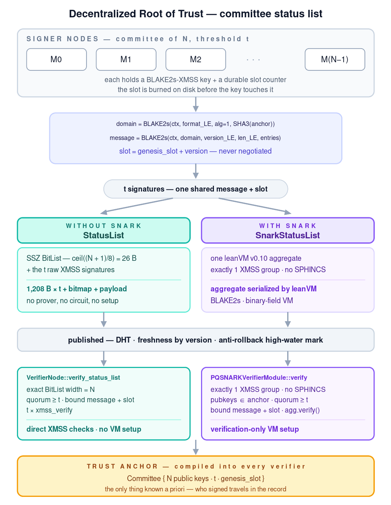

# Post-Quantum Decentralized Root of Trust

This project replaces a single signing key at the root of a credential-status
system with a post-quantum `t`-of-`N` committee.

The committee publishes complete snapshots of the credential fingerprints that
are currently valid. Presence means validity; removing a fingerprint in a newer
snapshot revokes the corresponding credential.

Committee members sign each snapshot with leanVM's synchronized XMSS over
BLAKE2s-256. The quorum can be published in either of two forms:

- `StatusList`: the raw XMSS signatures and a bitmap identifying their signers;
- `SnarkStatusList`: one leanVM aggregate proof over the same signatures.

A verifier needs a fixed committee anchor and one published record. Storage and
distribution are outside this project: deployment assumes a secure distributed
Verifiable Data Registry (VDR) that establishes one canonical current record for
the status list and returns that single record. This library independently
authenticates the returned record against its anchor and applies local persistent
anti-rollback protection. It does not implement the VDR, discover replicas,
rank competing responses, or choose among candidate records.

> This is a research prototype. Committee rotation is not implemented.

## Architecture



The editable diagram is available at
[`docs/architecture.svg`](docs/architecture.svg).

The protocol flow is:

```text
Committee anchor
    |
    +-- derive deployment domain
    |
Status-list entries + version + domain
    |
    +-- BLAKE2s-256 framed message
    |
    +-- slot = genesis_slot + version
    |
    +-- t XMSS signatures
            |
            +-- StatusList      (bitmap + raw signatures)
            |
            +-- SnarkStatusList (leanVM aggregate proof)
                        |
                        +-- secure distributed VDR (external, one canonical record)
                                    |
                                    +-- local authentication + anti-rollback
```

## Trust anchor

The `Committee` anchor contains:

- the ordered list of `N` XMSS public keys;
- the threshold `t`, with `1 <= t <= N`;
- the genesis XMSS slot.

The anchor is fixed for the lifetime of the committee and is embedded by each
verifier. The member order is significant because raw records identify signers
by their index in this list.

An update is authorized only when at least `t` distinct members sign the same
message at the slot assigned to its version.

## Signed message

The signed message is a 32-byte BLAKE2s-256 digest. It binds:

- the committee anchor;
- the algorithm identifier;
- the message-format generation;
- the status-list version;
- the number of entries;
- every entry in order.

The deployment domain is:

```text
BLAKE2s-256(
    "decentralized-root-of-trust/status-list-domain" ||
    format_generation_le_u32 ||
    algorithm_tag_u8 ||
    anchor_fingerprint[32]
)
```

`anchor_fingerprint` is SHA3-256 of the anchor's canonical SSZ encoding. SHA3 is
used here as an application-level object fingerprint; XMSS signing and the
status-list message use BLAKE2s-256.

The status-list message is:

```text
BLAKE2s-256(
    "decentralized-root-of-trust/status-list-message" ||
    domain[32] ||
    version_le_u32 ||
    entry_count_le_u64 ||
    entries[32]...
)
```

All integers have a fixed-width little-endian encoding. The explicit entry count
and fixed-size entries make the framing unambiguous. Entry order is significant.

The current construction uses message-format generation `2` and algorithm tag
`1`.

## XMSS slot discipline

XMSS is stateful. A member must never sign twice with the same key and slot,
including retries of the same message.

The protocol assigns one common slot to each version:

```text
slot = genesis_slot + version
```

`Committee::slot_for` is the authoritative implementation of this derivation.

`AtomicSlotCounter` holds an exclusive cross-process lock for the signer state.
Its state file is a fixed 8 KiB journal with two alternating, checksummed
records. Each record binds the key fingerprint, a monotonic generation and
`next_free`. The whole file is allocated and directory-synced at first
provisioning; an existing textual v2 counter is migrated once without changing
its durable frontier.

Each ordinary reservation then performs only this synchronous sequence:

1. overwrite the inactive record with the next generation and advanced
   `next_free`;
2. call `sync_data()` and wait for it to succeed;
3. only then produce the XMSS signature.

No runtime, background worker or batching is involved. Sequential signing burns
exactly the slot being returned; `reserve_at` may additionally skip slots for
protocol rounds that the member missed, but never reserves future rounds. A
crash during the record write leaves the previous checksummed generation usable;
a crash after the durability barrier finds the advanced generation, whether or
not signing completed. A crash may therefore discard a signature, but cannot
make that slot available again under the filesystem durability contract.

The steady-state path neither creates temporary files nor renames directory
entries, so it avoids their metadata overhead without weakening burn-before-sign.

## Published records

Both record types carry:

- the algorithm tag;
- the complete status-list snapshot;
- the version;
- evidence of a quorum.

| Property | `StatusList` | `SnarkStatusList` |
|---|---|---|
| Evidence | raw XMSS signatures | leanVM aggregate proof |
| Signer identity | SSZ bitmap | public keys declared by the aggregate |
| Cryptographic verification | one XMSS verification per signer | one aggregate-proof verification |
| Verification entry point | `VerifierNode::verify_status_list` | `PQSNARKVerifierModule::verify` |

### Raw record

`StatusList` uses an SSZ `BitList` whose logical length must equal the committee
size. Each set bit selects one public key from the anchor, and the signature list
must contain exactly one signature for each set bit.

The representation provides:

- canonical signer ordering;
- structural signer distinctness;
- no public-key duplication in the record;
- an exact committee-width boundary.

### Aggregated record

`SnarkStatusList` carries a leanVM aggregate. leanVM supports a broader
statement language, but this protocol accepts only:

- exactly one XMSS group;
- exactly one slot and message for that group;
- no claims from other signature families.

The aggregate currently includes the signers' public keys. The verifier checks
each key against the committee anchor before accepting the proof.

## Verification

The SNARK verifier applies these checks in order:

1. the aggregate contains exactly one XMSS group and no other signature family;
2. every declared signer belongs to the committee;
3. the aggregate message equals the message recomputed from the record;
4. the aggregate slot equals `committee.slot_for(version)`;
5. the signer count reaches the threshold;
6. the leanVM aggregate proof verifies.

The raw verifier enforces the equivalent policy:

1. the signer bitmap has exactly the committee width;
2. its population equals the signature count;
3. the signature count reaches the threshold;
4. the version maps to a valid slot;
5. every named committee key verifies its signature over the recomputed message.

Verification authenticates a record but does not establish freshness.

## Freshness and external storage boundary

`HighWaterMark` stores the highest accepted version for one anchor fingerprint.
A verified record is accepted only when its version is strictly greater than the
stored mark.

The mark is updated only after successful cryptographic verification. A hostile
record cannot advance it by declaring a large version.

Its lifecycle is deliberately explicit and fail-closed:

- `HighWaterMark::create` is only for first provisioning and refuses every
  existing state-file entry;
- `HighWaterMark::open` is the normal startup path and refuses missing,
  unreadable, malformed, or foreign-anchor state;
- `HighWaterMark::load_from_trusted_source` is an explicit recovery path for a
  lost or invalid local mark. It writes the version of an already authenticated
  canonical-latest record obtained from the trusted Verifiable Data Registry,
  and refuses to replace valid state for the same anchor.

The VDR contract is an external deployment assumption, not an implementation in
this crate. Normal intake is exactly one record through `RawNode::accept` or
`SnarkNode::accept`: decode, authenticate the committee evidence, then offer the
authenticated version to the mark. An invalid record is refused without moving
the mark, and the library never falls back to another candidate.

Recovery has a stronger precondition than ordinary authentication. Before
calling `load_from_trusted_source`, the integration layer must establish that
the record is the VDR's canonical latest value and verify its raw quorum or
SNARK against the exact anchor. Merely finding an old record whose signatures
still verify is not sufficient for recovery.

## Wire format

The committee anchor, `StatusList`, `SnarkStatusList`, XMSS public keys and
XMSS signatures use SSZ.

- `XmssPublicKey` is 32 bytes.
- `XmssSignature` is 1208 bytes.
- malformed SSZ offsets, lengths and trailing bytes are rejected;
- raw records require bitmap population and signature count to agree;
- leanVM aggregate bytes are accepted only when decode followed by re-encode is
  byte-for-byte identical.

Records from incompatible protocol generations are rejected rather than
silently upgraded.

## Build

The repository pins Rust 1.98.1, with `rustfmt` and `clippy`, in
[`rust-toolchain.toml`](rust-toolchain.toml). Rustup selects and installs that
toolchain automatically. The pin is for reproducible builds and lints; leanVM
v0.10 does not require a particular compiler. Benchmark figures belong to the
compiler that built the binaries (recorded in `env.txt`), so results obtained
under different pins must not be mixed: moving from Rust 1.90.0 to 1.98.1 left
the XMSS and SNARK timings unchanged within noise and made ML-DSA verification
faster ([`docs/mldsa-statement-digest.md`](docs/mldsa-statement-digest.md)).

```sh
cargo build --release
```

Use `--release` for commands that initialize the prover. The initial build
compiles the leanVM dependency tree and may take several minutes.

`.cargo/config.toml` configures:

- `target-cpu=native`, which makes release binaries host-specific;
- `RUST_MIN_STACK=512MiB`, a precaution against deep recursion in the prover.
  It applies only to processes Cargo starts (`cargo run`, `cargo test`); the
  benchmark scripts run their binaries directly, so measured processes do not
  receive it. leanVM v0.10 does not require it: a prover at N=500, t=334
  aggregates and verifies 20 updates without it. `env.txt` records what the
  measured processes actually receive.

## Run

Combined SNARK demonstration:

```sh
cargo run --release --bin decentralized-root-of-trust
```

Raw quorum path:

```sh
cargo run --release --bin raw_agg
```

Single XMSS committee member:

```sh
cargo run --release --bin signer
```

The independent [`mldsa/`](mldsa/) crate implements the parallel raw-quorum
construction with FIPS 204 ML-DSA-65. It exposes a stateless signer, an SSZ
committee anchor, an SSZ `MlDsaStatusList` carrying a signer bitmap and raw
signatures, and a verifier that keeps decoding separate from authorization.
The canonical statement binds the algorithm, committee-derived anchor identifier,
version and ordered fingerprint list. Members sign its 64-byte SHAKE256 digest
with ordinary ML-DSA.Sign and the empty FIPS 204 context: hashing at the
application level as FIPS 204 section 5.4 describes, not the HashML-DSA mode.
Signing the statement itself made every signature verification re-read the
whole list; [`docs/mldsa-statement-digest.md`](docs/mldsa-statement-digest.md)
explains the two flows, the standard's condition on the digest, and the
measured difference, reproducible with `tools/mldsa_statement_experiment.sh`. This path is not an
input to leanVM's XMSS aggregate and does not produce a SNARK.

```sh
cargo run --release --manifest-path mldsa/Cargo.toml --bin mldsa_signer
FIXTURE_PARENT="$(mktemp -d)"
cargo run --release --manifest-path mldsa/Cargo.toml --bin mldsa_fixture -- "$FIXTURE_PARENT/records" 5 3 20
cargo run --release --manifest-path mldsa/Cargo.toml --bin mldsa_raw_agg -- "$FIXTURE_PARENT/records" 20
```

`mldsa_raw_agg` verifies a pre-generated corpus: `mldsa_fixture` must first
write it to a directory that does not exist yet, with arguments `N t updates`.

Small local walkthrough:

```sh
cargo run --release --example local_demo -- raw
cargo run --release --example local_demo -- snark
```

## Split deployment

The prover and verifier can run as separate processes:

```sh
cargo run --release --bin prover -- ./artifacts
cargo run --release --bin verifier -- --init-state ./artifacts  # once
cargo run --release --bin verifier -- ./artifacts
```

The prover writes:

```text
artifacts/
  anchor.bin
  update-NN.bin
  canonical.bin
  attack-outsider.bin     check 1: a signer outside the anchor
  attack-tampered.bin     check 2: the list differs from the signed one
  attack-version.bin      check 2: the version differs from the signed one
  attack-slot.bin         check 3: a full quorum at a slot the version does not derive to
  attack-short.bin        check 4: a genuine proof over t - 1 signatures
  attack-proofbody.bin    check 5: honest claims, one proof-body bit flipped
```

Each forgery passes every check except the one named, so removing any single
check from the verifier makes exactly that artifact accepted.

`update-*` records form the measured verification corpus, `canonical.bin` is the
single current-record fixture supplied to the anti-rollback flow, and
`attack-*` records must be rejected. The verifier exits with a non-zero status
when any expectation is violated.

`--init-state` is an explicit first-provisioning operation and fails if the
state already exists. Normal verifier startup only opens existing state and
fails closed if it cannot be used. `verifier-highwater.state` is local verifier
state and must not be published or shared between nodes.

Each prover run creates a fresh committee, so artifacts from different runs are
not interchangeable.

## Container demo

The independent crate under [`demo/`](demo/) runs a ten-member container
network.

```sh
./demo/docker/demo.sh raw up
./demo/docker/demo.sh raw round
./demo/docker/demo.sh raw revoke
./demo/docker/demo.sh raw verify
./demo/docker/demo.sh raw crash
./demo/docker/demo.sh raw down
```

Use `snark` to publish aggregated XMSS records, or `mldsa` to publish the
raw ML-DSA-65 quorum form:

```sh
./demo/docker/demo.sh mldsa up
./demo/docker/demo.sh mldsa round
```

The `crash` scenario is intentionally available only for `raw` and `snark`:
it tests durable XMSS one-time-slot burning, a property ML-DSA does not have.
See [`demo/README.md`](demo/README.md) for the topology and scenario details.

## Tests

Run the complete test suite with:

```sh
cargo test
```

The suite covers:

- XMSS slot allocation, persistence and exhaustion;
- cross-process state-file locking;
- raw quorum construction and verification;
- status-list message framing and domain separation;
- SSZ decoding under hostile byte mutations;
- freshness and rollback protection;
- all verifier checks using real leanVM proofs;
- rejection of multi-group and non-XMSS aggregate statements;
- node-level proof-to-freshness integration.

`tests/lock_two_processes.rs::child_probe` is intentionally marked
`#[ignore]`. It is a subprocess fixture, not skipped coverage. The two parent
tests re-execute that exact test with `--ignored --exact`, provide the required
arguments and assert its output. Running it as an ordinary standalone test would
not provide the parent process protocol it expects.

Mutation-test patterns can be checked or executed with:

```sh
tools/mutate.py check
tools/mutate.py
```

The current catalog contains 25 mutations. Each removes or weakens one
security-relevant check and must be detected by the test suite.

GitHub Actions runs formatting, Clippy with warnings denied, the mutation
catalog consistency check, and the complete tests for the root, `mldsa/` and
`demo/` crates. It uses one Linux job so the expensive leanVM
build is shared by all checks in that run. Benchmarks, container scenarios and
the full mutation campaign remain explicit local jobs; they are intentionally
excluded from pull-request CI.

## Benchmark

The benchmark harness runs six isolated targets: an XMSS protocol signer, an
ML-DSA cryptographic signer, the XMSS prover and verifier, and two raw
relying-party verifiers. ML-DSA signing has no persistent one-statement-per-version
state yet, so its cost is not a protocol-level equivalent of the XMSS signer.

```sh
./benchmark.sh
RUNS=30 WARMUP=3 ./benchmark.sh
TARGETS="signer mldsa_signer prover verifier raw_agg mldsa_raw_agg" ./benchmark.sh
PLOT=1 ./benchmark.sh
```

Defaults:

- `RUNS=24`;
- `WARMUP=2`;
- `N_UPDATES=20` rounds inside each process run;
- status list growing by one entry per round (1 to 20 entries) unless
  `LIST_ENTRIES=L` fixes its size;
- `TARGETS="signer mldsa_signer prover verifier raw_agg mldsa_raw_agg"`;
- `COOLDOWN_SECONDS=2` before every target process;
- balanced target ordering (`INTERLEAVE=1`);
- plotting disabled by default (`PLOT=0`).

Every process runs from a frozen copy of its binary in `OUTDIR/bin`, not from
`target/release`: `tools/freeze_bins.sh` takes each executable's real path from
Cargo, copies it and records its SHA-256 and build parameters, which
`env.txt` repeats. The hashes are checked again after the last run. A copy is
byte-identical, so this only fixes *which* program is measured, not how.

Thus the default harness starts each target 26 times: two warm-ups whose data
is discarded, followed by 24 measured process runs. Each measured run contains
20 update-level observations. Those observations share one process and are not
treated as independent replicates; the reported cross-run statistics use each
run's median as their unit of analysis.

Before measurement, unmeasured fixture processes create both corpora.
`committee_fixture` creates the XMSS committee and raw `StatusList` records;
`raw_agg` verifies them and `prover` consumes the same signed inputs to emit
`SnarkStatusList` records. `mldsa_fixture` independently creates the
ML-DSA-65 anchor and `MlDsaStatusList` corpus consumed by `mldsa_raw_agg`.
Fixture generation and signing are outside verifier/prover timings. Consequently
each measured raw process is a relying-party verifier and the measured prover is
one aggregator, not a hidden committee signer. `BENCH_SELF_CONTAINED=1` retains
the older diagnostic XMSS process shape for back-comparison.

Every figure belongs to a workload `(N, t, L)`: committee size, threshold and
the number of entries in the status list. A record carries the whole list, 32
bytes per credential, and every scheme reads it once to authenticate it, so `L`
enters record size and verification time on all three paths.
`LIST_ENTRIES=1000 ./benchmark.sh` makes every version carry exactly 1,000
entries, one of them replaced per version; unset, the list grows by one entry
per version, which is cheap to run and says nothing about a list of realistic
size. The fixtures draw each version's quorum as `t` distinct members spread
over the whole committee, reproducibly from the version number
(`spread-splitmix64-v1`), so a small quorum is not confined to the start of a
large anchor. The workload is not a label: both fixtures state theirs in
`workload.txt`, every measured process reports the smallest and largest list it
handled, and the harness stops, withholding all numbers, if either differs from
what was declared. `workload.txt` in the output directory, `env.txt` and
`summary.txt` carry it. A figure is not to be carried to another list size;
measure that size. The self-contained shape and the `combined` target build
their own lists and are refused together with `LIST_ENTRIES`.

The default order is a Williams-style balanced crossover sequence rather than a
fixed round-robin: across a complete block, target position and immediate
predecessor are balanced. A complete block is N rows for an even number of
targets and 2N for an odd one; the harness warns when `RUNS` is not a multiple
of it, or when per-target run counts differ, since the order is then only
partly balanced. The cooldown reduces thermal carry-over between
processes; it does not assert equal package temperature, so `runs.csv` retains
each start time for drift analysis.

Size rows name the serialized object they measure: `signature_size` for one
XMSS or ML-DSA signature and `record_size` for the complete `StatusList`,
`MlDsaStatusList` or `SnarkStatusList`. All three verifier targets report
separate decode, verify-only and contiguous decode-plus-verify timings. Decode
covers everything parsed before the checks run: every signature on the raw
paths, and the leanVM aggregate as well as the SSZ container on the SNARK path.
Earlier SNARK runs billed aggregate deserialization to verify-only; their phase
columns are not comparable with later runs, but the end-to-end total is. The
end-to-end interval is used for receiver-cost comparisons and XMSS/SNARK
break-even. The three receivers stop their timers at the same point: when the
predicate returns, before the decoded record is released, and they read RSS
while it is still alive (`src/bench/timing.rs`).

Every timed phase is reported on two clocks. Elapsed time (`Instant`) is how
long a caller waits. CPU time is the kernel's account of the user and system
CPU the process used over all of its threads (`CLOCK_PROCESS_CPUTIME_ID`, read
inside the binaries around the same interval, outside the elapsed timer). They
answer different questions and are not interchangeable: the prover and the
SNARK verifier are multithreaded, so their CPU is a multiple of their elapsed
time, while the raw XMSS and ML-DSA verifiers are sequential and the XMSS
signer waits for the storage device. On the development host, at `N=10`, `t=7`,
`L=1000` and eight pinned CPUs, one proof took 0.48 s of elapsed time and 3.0 s
of CPU, and one SNARK verification 177 ms and 0.89 s. `summary.csv` has a
`*_cpu_per_item` and a `*_cpu_total` row next to each elapsed row;
`samples.csv` carries the per-update CPU readings as `*_cpu` phases, and the
validator recomputes the run statistics from them like the elapsed ones.

A verifier also has a cost it pays once per process, before its first
verification, reported as `ready` (elapsed and CPU): reading and decoding the
anchor, building the verifier and, on the SNARK path, setting up the circuit
(`setup`, which `ready` contains). All three verifier targets bracket the same
steps. A resident verifier pays it once; a process started for one request pays
`ready` plus one decode-plus-verify every time. `setup_cpu` reports the CPU of
the circuit setup for the prover and the SNARK verifier.

Memory rows are resident set size in MiB. A process peak is read twice, from
the process's own `VmHWM` and from the kernel through `/usr/bin/time -v`; when
the latter is unavailable its rows are absent rather than zero, and reports and
plots use `VmHWM` and say so. A peak covers the whole process, including setup
and, for the verifiers, the negative controls that follow the measured updates;
"RSS max during work" is the largest reading sampled after each honest update.
These describe the runs on this host and are not bounds for sizing a machine.

XMSS signer timings separate durable slot burn, cryptographic signing and
complete protocol cost. The burn waits for one `sync_data` per signature, so it
measures the storage under the slot journal as much as the scheme:
`SIGNER_STATE_DIR` (default `TMPDIR`) selects that directory, `env.txt` and
`summary.txt` record its class (`ram`, `local`, `network`, `other`), filesystem,
device and mount, and a strict run refuses RAM-backed storage unless
`ALLOW_RAM_SIGNER_STATE=1` asks for that scenario by name. On the development
host the burn took 0.57 ms on ext4 and 0.003 ms on tmpfs.
The optional `combined` target alone reports
`proof_size`, because it measures `SnarkStatusList::proof_bytes()` rather than
the whole record. Even-sized samples use the conventional median, the arithmetic
mean of the two central observations.

Each run writes a `bench-<timestamp>/` directory containing environment
metadata, raw samples, per-process rows and summary statistics. The harness
refuses to report timings when a target reports a failed security expectation.
`runs.csv` also records load average, mean frequency over the selected CPUs and
the highest readable temperature immediately before and after every target
process. `drift.csv` compares the first and last quarter of run medians and
flags a change above 15%; it never removes or rewrites samples. A strict run
also requires a clean Git tree. Exploratory dirty-tree runs preserve
`source.patch` and `source-status.txt`. The patch omits untracked file contents;
such pilot runs may not be exactly reconstructible. Publication mode requires a
clean committed tree.

A campaign directory also keeps what the numbers were taken from: `logs/` with
the stdout and stderr of every process (including the full `/usr/bin/time -v`
report), the signed inputs the script generated under `inputs/`, the verifier
corpus when small and its hashes always (`corpus.sha256`), and
`prover-outputs.sha256` with the hash and size of every record each prover
execution wrote; large proofs are not copied. `runs.csv` records, per process,
elapsed and CPU time, page faults, context switches and the host's swap,
memory-stall and OOM counters around it; `summary.txt` reports whether any
measured run paged.

`OUTDIR` must be new or empty: one directory holds one campaign. `status.txt`
reads `running` during the campaign, `failed` (numbers withheld) after any
abort, and `complete` only once every check has passed. Until then
`summary.csv`, `summary.txt` and `drift.csv` do not exist under those names;
they are staged and moved in at the end, together with `outputs.sha256`, which
binds metadata, samples, per-run rows, summaries and `inputs.sha256` (the
signed fixture inputs, verified unchanged after the last run). The CSV validator
also recomputes every per-run median, mean, sd, minimum, maximum, total and
record size from `samples.csv`, within the three-decimal rounding of both files,
so a statistic that does not follow from its own samples is an error rather
than merely numeric.

`PLOT=1` runs [`tools/plot_benchmarks.py`](tools/plot_benchmarks.py) after the
measurements and writes standalone SVG figures plus `plots/overview.md` in the
output directory. It compares receiver decode plus verification, record and
signature sizes, signing phases and peak process RSS. The table includes every
`summary.csv` metric with run count and between-run quartiles; a single run
receives no uncertainty estimate. The plotter refuses a fixed benchmark whose
`status.txt` is not `complete` or whose files no longer match
`outputs.sha256`. Existing results can be plotted without rerunning the
benchmark:

```sh
python3 tools/plot_benchmarks.py bench-<timestamp>
```

The plotting tool requires Python 3.10 or newer, uses only the standard
library and leaves the source CSV files unchanged.

### Committee scaling

[`committee-scaling-benchmark.sh`](committee-scaling-benchmark.sh) orchestrates
`benchmark.sh` over the requested grid `N = 5, 10, 100, 500, 1000, 1500`.
Only `5, 10, 100` are unconditional; the larger points require enough available
memory. It applies the strict two-thirds policy

```text
t = floor(2N/3) + 1
```

as an explicit committee-authorization threshold, not as a claim that this
project implements a consensus protocol.

```sh
./committee-scaling-benchmark.sh
LIST_ENTRIES=1000 ./committee-scaling-benchmark.sh
PLAN_ONLY=1 ./committee-scaling-benchmark.sh
STUDY_MODE=publication PIN_CPUS=0-7 ./committee-scaling-benchmark.sh
RESUME=1 OUTDIR=committee-scaling-<timestamp> ./committee-scaling-benchmark.sh
```

The default `STUDY_MODE=pilot` uses three measured runs, one warm-up and one
ascending sweep. It is intentionally labelled exploratory and is useful for
resource discovery, not for paper results. `STUDY_MODE=publication` defaults to
24 measured runs, two warm-ups, ten seconds of cooldown and two complete
sweeps. The second sweep reverses the committee-size order, so host-time and
committee size are not perfectly confounded. Publication mode requires
`STRICT_ENV=1`, a clean committed tree, an explicit CPU mask, at least ten runs,
`INTERLEAVE=1` and an even number of sweeps (at least two), so that ascending and
descending sweeps occur equally often. Its run count must be a multiple of four, completing
the balanced design for the four per-point targets (`prover`, `verifier`,
`raw_agg`, `mldsa_raw_agg`). These checks run before anything is built. The
report states the sweep and role design that actually ran; `plan.csv` records
the planned sweep order and `schedule.csv` every stage as it starts and ends,
while each `benchmark.sh` directory keeps its own `schedule.csv` of processes,
warm-ups and cooldowns. Any session whose early/late
medians differ by more than 15% is marked unstable and withheld; no outlier is
discarded.

Before doing any work, the script prints and records the host's physical and
available RAM, the operating-system reserve, the process cap, free-disk reserve
and largest admitted committee. `N=500`, `N=1000` and `N=1500` require at least
8, 12 and 20 GiB respectively of usable benchmark budget; a smaller host stops
at `N=100`. The thresholds are admission policy, not a fitted leanVM memory
curve.

Every build, fixture generation and benchmark point runs serially in its own
process group and, by default, in a systemd user scope with kernel-enforced
`MemoryMax` and `MemorySwapMax`. The polling guard remains a second line of
defence: it terminates and withholds a stage if group RSS exceeds the cap,
available RAM falls below the reserve, free disk falls below 8 GiB, global swap
growth exceeds 64 MiB, or the 90-minute timeout expires. If user scopes are not
available, the default `HARD_MEMORY_LIMIT=required` refuses to execute;
`HARD_MEMORY_LIMIT=auto` explicitly opts a pilot into the weaker polling
fallback. Publication mode always requires the kernel-enforced backend.
`MAX_RSS_MB`, `RESERVE_MB`, `MIN_FREE_DISK_MB`, `MAX_SWAP_GROWTH_MB` and
`POINT_TIMEOUT_MINUTES` can make the limits stricter. An unsafe `MAX_RSS_MB`
request is clamped to the host-derived ceiling.

An output directory is never silently reused. `RESUME=1` requires the stored
campaign fingerprint to match source patch, Cargo lockfile, scripts, host,
measurement parameters and CPU policy. It also reuses the original N set and
recalculates the hard cap from current availability. It refuses to resume only
when the current usable cap has fallen below the admission threshold of the
largest recorded N. A session completed earlier keeps its `complete` status even
if the resumed invocation stops before reaching it; the final validation still
rechecks its data and marks only a session whose data is damaged. Every status
change is also appended to that directory's `status-history.txt`.

A campaign has one status-list size for all its points (`LIST_ENTRIES`, as in
`benchmark.sh`; unset is the growing list), so a sweep varies the committee and
not the list. It is part of the campaign fingerprint, every table of the report
states `(N, t, L)`, and `scaling.csv` has a `list_entries` column. To compare
list sizes, for example 100, 1,000 and 10,000 credentials, run one campaign per
size. `N` and `t` move together under the two-thirds policy, so a sweep does not
separate the effect of one from the other.

Before the sweep, `benchmark.sh` measures `signer` and `mldsa_signer` once
as separate single-member campaigns, using the same run and warm-up counts.
Neither is repeated for every `(N,t)`: per-member signing cost is independent of
committee size and must not be multiplied into one process latency. `signer.csv`
keeps XMSS protocol/slot/crypto costs separate from ML-DSA crypto-only signing.

At every point, unmeasured XMSS and ML-DSA fixture processes generate their
respective signed corpora. The measured `prover` is therefore one XMSS
aggregator holding public keys and ready-made signatures—never `N` aggregators
or one process retaining all committee secret keys. Both raw measurements are
verifier-only processes. The three published forms (raw XMSS, aggregated XMSS
and raw ML-DSA) are measured the same way: the same workload, the same timer
boundaries, both clocks, the same once-per-process `ready` cost, and paired
comparisons two at a time. ML-DSA is a different signature construction, not
another encoding of the same XMSS quorum, so what the comparison shows is cost;
it says nothing about the equivalence of their security models, key management
or state.

The top-level output contains:

- `memory-decision.txt` — the announced admission and runtime limits; each
  resume appends its own block below the original decision;
- `signer.csv` and `signer/benchmark/` — the XMSS and ML-DSA single-member
  campaigns, measured once for the complete sweep;
- `manifest.csv` — completed, stopped and RAM-excluded points;
- `scaling.csv` — run-level medians combined across sweeps, XMSS/SNARK wire
  size, RSS, paired verification deltas and derived ratios, plus ML-DSA decode,
  verification, combined time, record size and verifier RSS. Memory columns are
  MiB: per role the typical (median) and largest observed process peak, the
  largest RSS sampled during honest updates, and `peak_rss_source` (`kernel`
  for `ru_maxrss`, `vmhwm` when a kernel reading is missing; never 0);
- `costs.csv` — what each role costs for every completed point, one row per
  role (prover and the three verifiers), quantity (`per_update`, `setup`,
  `ready`), clock (`elapsed`, `cpu`) and per-run statistic: `median` (each run
  contributes the median of its updates, the typical update) or `mean` (what a
  total or a budget is made of; a median hides the tail). Each row has the
  quartiles, the mean and its 95% CI across runs;
- `comparisons.csv` — the three verifiers compared two at a time on both
  clocks: the paired difference of decode-plus-verify with its 95% CI, which
  one is slower when the interval excludes zero, the ratio, and the descriptive
  break-even against the SNARK verifier;
- `all-runs.csv` — every measured run of every session with its committee, list
  size, sweep, the sweep's direction, the point's position in it and the
  process start time, for analyses by block, by time or across sweeps;
- `report.txt` — the tables above in readable form and the first observed
  points;
- `pressure.csv` — paging, memory-stall time and OOM kills during every guarded
  stage; the disk reserve is checked on every filesystem the campaign uses;
- `Nxxxx-tyyyy/session-XX/benchmark/` — the complete `benchmark.sh` output for
  every sweep session at each point, including raw observations and confidence
  intervals;
- `Nxxxx-tyyyy/session-XX/bin/` — the frozen binaries, `SHA256SUMS` and
  `PROVENANCE` that the session's fixtures and measurements all ran from.

The paired interval below is Student's t for the mean of the per-run
differences, with the exact quantile for every df (`tools/stats.awk`, shared
with `benchmark.sh`); with fewer than two paired runs it does not exist, and
nothing is confirmed. `summary.csv` names the same kind of interval
`mean_ci95_halfwidth` and leaves sd, CV and the interval empty, never 0, when a
metric has a single run.

The report calls one verifier slower than another only when the paired 95%
confidence interval of their difference excludes zero. For a raw verifier
against the SNARK verifier it then also reports a descriptive break-even, per
paired run and on one clock:

```text
ceil(prove / (raw_decode_verify - snark_decode_verify))
```

`scaling.csv` carries the elapsed one for raw XMSS as `break_even_elapsed_*`;
`comparisons.csv` carries all four (XMSS and ML-DSA, elapsed and CPU). It reads:
with typical per-update costs on that clock, this many verifications of one
record cost as much as the proof saved. It is withheld if any paired run has no
positive saving; that run is not discarded. It is a restricted indicator, and
the report says what it is not:

- not a cost: elapsed milliseconds of processes with different parallelism do
  not add up to CPU, energy or money, which is why both clocks are reported;
- not a budget: it is built from medians, and totals are made of means
  (`costs.csv` has both);
- not an interval: its Q1/Q3 are the spread of the ratio across runs;
- not end-to-end: it leaves out setup and `ready` costs, signing, network and
  storage, and more verifiers do not make any single request faster, because
  the proof must exist before anyone verifies it.

`costs.csv` holds the inputs of a fuller model on both clocks: `P` (prover
`per_update`), `R` and `S` (raw and SNARK verifier `per_update`), `Sp` (prover
`setup`) and `Sv` (SNARK verifier `ready`). With `U` updates per prover process,
`K` verifications per verifier process and `M` verifications per update, the
aggregated form costs less when `P + Sp/U + M·(S + Sv/K) < M·R`, all in one
unit. The harness reports the measured quantities and chooses none of `U`, `K`,
`M`, the unit or a threshold: those belong to the deployment being decided.

A "first observed point" in the report is the smallest `N` of the completed
grid at which a condition held, for that list size, host and session. It is not
the exact `N` at which the regime changes, not a statement about every larger
`N`, and not about points the campaign did not complete. The report reads
several comparisons off one grid, each with its own 95% interval; the intervals
are not simultaneous, so a candidate should be confirmed by an independent
campaign around it. Sessions are checked for complete runs and samples;
inherited per-target run overrides are rejected. The paired intervals assume
independent repetitions on this host and session, not an effect established
across days or machines; `all-runs.csv` keeps each run's sweep, position and
start time so that the blocks can be analysed as blocks.

That analysis is a separate step, run on a finished campaign:

```sh
python3 tools/analyze_scaling.py committee-scaling-<timestamp>
```

It writes `analysis/report.txt` and three CSV files and changes nothing else.
A session is one sweep's visit to a committee size: its own build, fixture and
stretch of time. The tool reports, for every role and both clocks:

- the **session effect**: the spread of the session means, an F test of it and
  the share of the variance that lies between sessions (intraclass
  correlation). Where that share is well above zero, runs of one session are
  not independent and the report's interval is too narrow;
- the **drift inside each session**: the slope of the per-run values against
  run order with its 95% interval, and the lag-1 autocorrelation of the
  residuals;
- each paired comparison under **three intervals**: every pair independent (the
  report's own), sessions as fixed blocks (a statement about these sessions),
  and sessions as the unit of replication (a statement about another session
  on this host, with one degree of freedom fewer than there are sweeps);
- the **whole family at once**: Holm-adjusted p-values and Bonferroni
  simultaneous intervals over every committee size, verifier pair and clock,
  and the first observed points under each reading.

More sweeps, not more runs per session, narrow the session-level interval: two
sweeps leave it one degree of freedom, so it confirms a difference only when
the two sessions agree closely. The tool needs no third-party package, uses the
95% level the harness already uses, and chooses no threshold.

After a scaling campaign, generate its figures and tables with:

```sh
python3 tools/plot_benchmarks.py committee-scaling-<timestamp>
```

The scaling figures show measured `(N,t)` points for receiver time, full record
size, proving cost, peak RSS and confirmed break-even. `plots/overview.md`
lists excluded or unfinished points from `manifest.csv` and reports the
single-member signer campaign separately. Dashed connectors are visual guides
between observed points, not measurements at intermediate committee sizes.

## Dependencies

The root crate pins leanVM v0.10 to commit
`73a5f5dcd34d8dfe76a32a44dce0c0f87c86feeb`.

The main direct dependencies are:

- `leanvm`: XMSS aggregation and proof verification;
- `primitives` from the same leanVM revision: BLAKE2s-256;
- `ethereum_ssz` and `ethereum_ssz_derive`: canonical wire containers;
- `sha3`: credential and anchor fingerprints;
- `rand`: application-level randomness;
- `libc`: one function, the process CPU clock used by the benchmark binaries.

### The one `unsafe` call

The benchmark reports CPU time next to elapsed time, per operation. Rust's
standard library has no process CPU clock, so
`bench::timing::process_cpu_time` calls the operating system's
`clock_gettime(CLOCK_PROCESS_CPUTIME_ID, ..)` through `libc`, and calling a C
function requires `unsafe`. It is the only `unsafe` in this repository's own
code: one line in `src/bench/timing.rs` and its twin in
`mldsa/src/bin/support/mod.rs`.

- **What it does.** It passes the kernel a 16-byte `timespec` that lives on the
  function's stack; the kernel writes seconds and nanoseconds into it. No
  memory is allocated and no pointer is kept. A failing call stops the process
  instead of reporting zero CPU.
- **Who calls it.** The six measurement binaries and `tests/cpu_clock.rs`. The
  protocol modules (`node`, `protocol`, `state`) and the container demo do
  not: signing, verification, slot state and anti-rollback are unaffected.
- **Dependency.** `libc` was already in the tree through `rand` and
  `getrandom`; only the direct edge was added.
- **Limits it brings.** The crates cannot declare `#![forbid(unsafe_code)]`
  while the benchmark module is part of the library, and they do not compile
  on Windows, which has no such function (the benchmarks already require
  Linux's `/proc`).
- **Alternatives considered.** A crate with a safe wrapper (`rustix`) would
  give the same numbers with no `unsafe` here, at the price of a new
  dependency. Reading `/proc/self/task/*/schedstat` needs neither, but costs
  10 to 20 microseconds per thread per reading, which distorts the smallest
  verifications. Deriving per-operation CPU from whole-process CPU (already
  recorded from `time -v`) was tested on a pilot campaign against the measured
  values: within 4% for the prover, but 24 to 25% off for a SNARK verification
  (setup and negative controls are inside the process total) and up to 67% off
  for a raw XMSS verification (twenty of them cost less than the 10 ms
  resolution). It was therefore not adopted.

`demo/` is a separate Cargo workspace.

## Limitations

- Committee rotation and hand-off are not implemented.
- One anchor is expected to govern exactly one status list. A list identifier is
  not currently included in the anchor.
- Status-list entries are not sorted or deduplicated. Different orderings of the
  same logical set produce different signed messages.
- The verifier predicate is stateless; rollback protection depends on the
  persistent high-water mark.
- The SNARK record carries the participating XMSS public keys.
- Secure distributed storage, consensus, replication, availability and the
  canonical-current lookup are VDR responsibilities assumed by this library and
  not implemented here.
- The project implements only XMSS with BLAKE2s-256. Other signature families
  supported by leanVM are outside the protocol and are rejected.

## Compatibility

The current wire format, signed-message construction, keys, signatures and proofs
are incompatible with earlier protocol generations. Existing artifacts and
durable signer state must be regenerated after upgrading.

There is no mixed-version acceptance mode. The Poseidon2 implementation is
preserved in the `poseidon2` branch.

## Development provenance

This project was developed with assistance from AI coding systems, including
Claude Opus 5.5, GPT-5.6 Sol/Terra, GPT-5.5 and Fable 5. AI-assisted changes are reviewed and
tested before being accepted. Responsibility for the design, implementation and
published commits remains with the repository maintainer.
